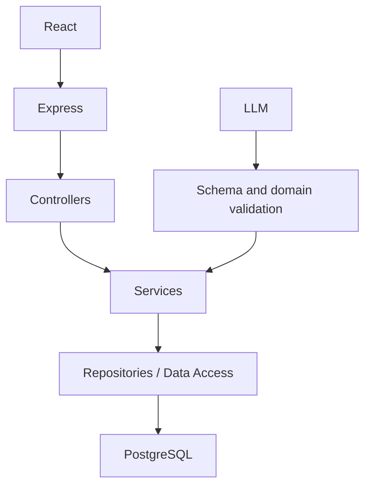

# RecallLoop

RecallLoop is an adaptive active-recall system. Learners study a topic, retrieve it from memory, receive rubric-based evaluation, and get deterministic review planning. The current foundation also includes authenticated goals, canonical knowledge, baseline assessment, learner state, and resource recommendations.

## Setup

Requires Node.js 20+ and PostgreSQL 16+.

```bash
copy .env.example .env
docker compose up -d postgres
npm install
npm run db:migrate -w server
npm run dev
```

- UI: http://localhost:5173
- API: http://localhost:3001/api/health

## Environment

`DATABASE_URL` configures PostgreSQL. `LLM_PROVIDER=mock` with an empty `LLM_API_KEY` runs deterministic extraction and evaluation without a vendor account. See [.env.example](.env.example).

## Commands

```bash
npm run dev
npm test
npm run test:integration -w server
npm run build
npm run db:migrate -w server
npm run db:seed -w server
```

`npm test` runs database-independent unit tests. `npm run test:integration -w server` requires PostgreSQL and applies the relational integration checks.

## Architecture



Controllers remain thin. Domain services own business rules. PostgreSQL owns durable state. The LLM only produces structured extraction/evaluation candidates; validated domain services own persistence, ownership, scheduling, and transactions.

## Product flow

`Goal -> Canonical Knowledge -> Baseline -> Learner Model -> Planner -> Study -> Recall -> Evaluation -> Learner Model -> Plan update`

- `/goals` manages learner goals.
- `/knowledge` browses curated role and skill requirements.
- Goal detail supports new, familiar, advanced, and Trust Me starting paths.
- `/baseline/:id/result` shows observed versus self-declared knowledge and focused resources.
- `/plan/today` shows deterministic work and reasons.
- `/learner` shows personal learner signals.

## Documentation

- [docs/ARCHITECTURE.md](docs/ARCHITECTURE.md)
- [docs/LEARNING_MODEL.md](docs/LEARNING_MODEL.md)
- [docs/POSTGRES_RUNTIME_MIGRATION_STATUS.md](docs/POSTGRES_RUNTIME_MIGRATION_STATUS.md)
- [docs/POSTGRES_CUTOVER_REPORT.md](docs/POSTGRES_CUTOVER_REPORT.md)
- [docs/POSTGRES_CUTOVER_AUDIT.md](docs/POSTGRES_CUTOVER_AUDIT.md)
