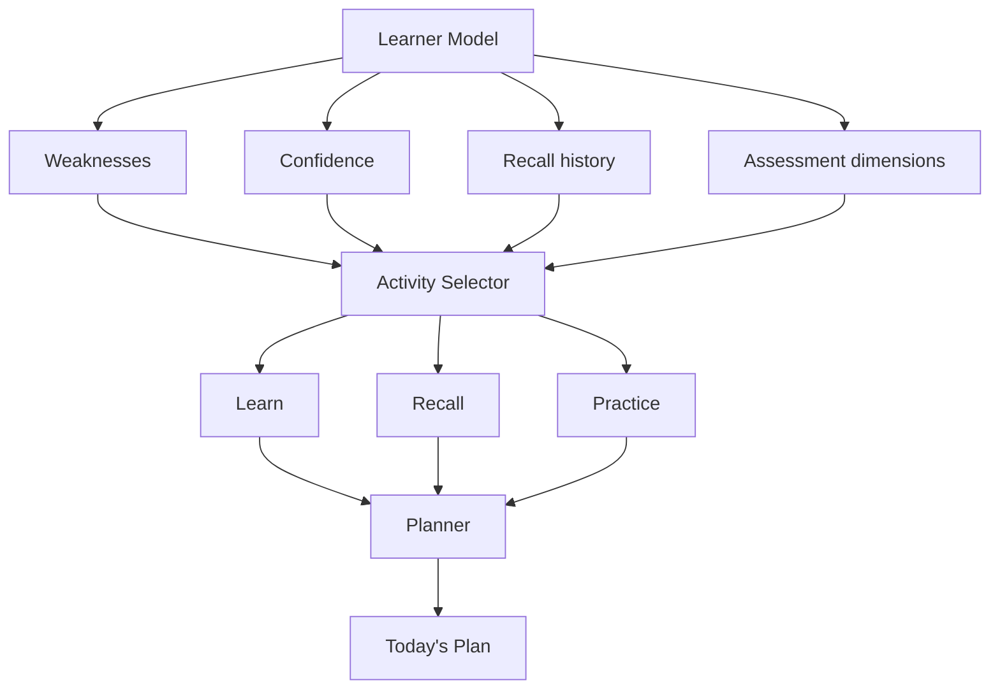

# Adaptive learning loop

RecallLoop adapts with deterministic rules over the evidence already stored in PostgreSQL. It does not use generated ranking, an external model, or synthetic learner metrics.

The responsibilities stay separate: **Question Selector** decides what to ask; **Resource Recommendation Service** decides what material may help; **Planner** decides when selected work fits; **Scheduler** decides when recall is due; **Learner Model** reports what the recorded evidence currently shows.

## Question selection and assessment

Assessment sessions select a fixed sequence suited to their mode. Rapid Fire mixes recognition MCQs and short recall prompts; Deep Recall asks for a descriptive response; Practice uses a scenario; Mastery Check samples recognition, recall, explanation, application, depth, and transfer. The adaptive question selector uses mastery, recent coverage, recent failures and successes, recent question types, and available time when selecting the next question.

Questions have stable database IDs and a unique identity per concept, question type, and exact prompt. Selection checks the most recent **20 attempts for that concept and learner** and tries alternate wording before reusing an exact question. When an exact repeat remains, `repetitionReason` records why it was selected (`spaced_recall`, `mastery_confirmation`, or `remediation`). This bounded window avoids an unbounded history scan.

Built-in MCQs cover a small representative seed set. Their options use concept-specific misconceptions, map to stored knowledge points, and grade against a persisted answer key with a deterministic explanation. Other question types retain rubric evaluation.

Assessment dimensions are recognition, recall, explanation, application, depth, and transfer. A dimension without evidence is returned as `null`; it is not treated as a zero score.

## Hints and evaluation

Hints are revealed one at a time and their usage is persisted on the attempt. Evaluation stores coverage, knowledge-point results, mistakes, strengths, and a dimension score. Evidence is discounted deterministically when hints were used (1.00, 0.85, 0.70, or 0.55 for zero through three hints). Those weights are product heuristics, not scientific mastery estimates.

## Recommendations and resources

After a submitted attempt, a deterministic practice recommendation considers coverage, mastery, recent low-coverage attempts, repeated missing knowledge points, assessment dimensions, and whether the concept is required by an active goal. It returns the highest-priority action with `actionType`, title, estimated minutes, priority, and a reason drawn from those inputs. The learner can act on it or finish for now.

The Resource Recommendation Service ranks existing resource metadata using concept coverage, observed learner level where available, fit to the available time, trust tier, freshness, goal skill match, and recorded application gaps. It returns at most four items and explains the coverage, time, difficulty, quality, freshness, and learner-state signals used. It does not claim learner evidence that is absent.

A Learning Pack combines fitting resources with explanation, application, and quick-recall activities. Its item minutes never exceed the requested budget. The planner adds a pack only when a weak concept matches a skill in the active goal, and stores resource links on the existing plan tasks.

## Review preferences and scheduler

`reviewMode` is stored on the user profile and exposed through Settings (`GET/PATCH /api/settings`):

- `automatic`: use the scheduler's recommended date as usual.
- `confirm`: show the recommended date and allow the learner to confirm or change it.
- `manual`: keep `ReviewState` authoritative, but do not add optional future reviews to the plan automatically. Due recalls remain visible.

The scheduler owns due dates and review state. The planner consumes due recalls; it does not calculate new review intervals.

## Learner Model

The learner model reports current stored evidence: attempt count, average confidence, average evaluated coverage, average hints used, mistake count, last attempt, next review, and per-dimension scores. Per-concept mastery is the persisted deterministic state updated after evaluated attempts. Concepts without submitted attempts have `mastery: null` and status `new`. The summary average includes assessed concepts only and is null when none have evidence. These are transparent product heuristics, not calibrated or scientifically precise estimates.

## Planner sequence and requiredness

The daily sequence uses explicit stages instead of sorting everything by one priority number:

1. Overdue recall, then recall due today.
2. Critical remediation after repeated low-coverage attempts.
3. Goal-required learning.
4. Learning Pack resources and explanation/application/recall activities.
5. Other evidence-led practice.
6. Optional mastery stretch work.

Every plan task is `must`, `recommended`, or `optional`. Due recall and critical remediation are must-do; goal-aligned learning and practice are recommended; evidence-supported stretch tasks are optional. Tasks are fitted in sequence to the available minute budget; work that does not fit is deferred.

Missed tasks remain in history with `missed` status. A new plan selects due recall, critical remediation, and high-value goal work within today's budget rather than copying the entire backlog. The plan reports how many previous-day missed activities match selected work (`carriedForwardCount`) and how many are deferred (`deferredCount`).

## Data and implementation boundaries

The existing PostgreSQL tables remain the source of truth. Small additive migrations store review preference, repetition reason, requiredness, stable question uniqueness, recommendations, and resource links. The implementation adds no RAG, vector search, queue, agent, or external API subsystem.
