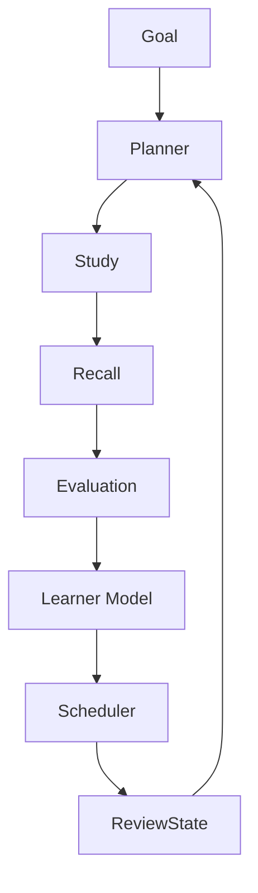

# Architecture — RecallLoop

## 1. System architecture

RecallLoop is a two-package npm workspace:

- `client/` — React + TypeScript + Vite + React Router
- `server/` — Express + TypeScript + Mongoose

MongoDB holds all durable state. There is no Redis, no queue, and no microservice split.

```
Browser  →  Vite (5173)  →  /api proxy  →  Express (3001)  →  MongoDB
                                      ↘  evaluator (mock or LLM)
                                      ↘  scheduler (deterministic)
```

## 2. Frontend → backend → database flow

Pages call `client/src/api/client.ts` only. The client never computes mastery, coverage, or due dates. Express controllers call services; services read/write Mongoose models.

## 3. Study session flow

1. `POST /api/study-sessions` creates a `StudySession` (`in_progress`).
2. `conceptService.createConceptsForSession` asks the evaluator to extract structured concepts.
3. Validated concepts are inserted into `concepts`.
4. `POST /api/study-sessions/:id/complete` marks the session completed and creates immediate recalls.

## 4. Recall flow

1. On complete, each concept gets a pending `RecallAttempt` with an **explain** question.
2. A `ReviewState` row is created with `dueAt = now` so the item appears on today's dashboard.
3. The learner answers at `/recall/:attemptId` (question only; no expected answer).
4. `POST /api/recalls/:id/submit` evaluates, stores the rubric, updates mastery, and schedules.

Later due reviews: dashboard/list-due calls `ensureDueRecallAttempts()`, which opens a new attempt using `suggestedRecallType` from the last evaluation.

## 5. Evaluation flow

`getEvaluator()` returns `MockEvaluator` or `LlmEvaluator`.

Live path: temperature 0, JSON object response, Zod validation, **one retry** on invalid output, `evaluatorVersion` stored on every evaluation.

Coverage is a function of knowledge-point statuses (`correct=1`, `partial=0.5`, `missing=0`). The parser **overwrites** any LLM `overallCoverage` with `deriveCoverage()`. Live evaluations also remap results onto the concept’s required knowledge points.

## 6. Scheduler flow

`services/scheduler/IntervalScheduler.scheduleNextReview(input) → ReviewStateSnapshot`

Coverage bands → `again | hard | good | easy`, then interval policy:

- again: 1 day
- hard: max(1, previous × 1.5)
- good: max(2, previous × 2)
- easy: max(4, previous × 3)

**This is an MVP scheduler and is not the final learning-science implementation.** Swap via `setScheduler()` / `Scheduler` interface. FSRS should replace `IntervalScheduler` only.

## 7. Data model

- `studysessions` — topic, material, status
- `concepts` — knowledge points, mastery
- `recallattempts` — question, answer, embedded evaluation
- `reviewstates` — scheduler fields isolated per concept

## 8. API map

| Method | Path                               | Purpose                              |
| ------ | ---------------------------------- | ------------------------------------ |
| GET    | `/api/health`                      | Liveness + mock flag                 |
| POST   | `/api/study-sessions`              | Create session + concepts            |
| GET    | `/api/study-sessions/:id`          | Session + concepts + pending recalls |
| POST   | `/api/study-sessions/:id/complete` | Complete + immediate recalls         |
| GET    | `/api/recalls/due`                 | Pending due attempts                 |
| GET    | `/api/recalls/:id`                 | One attempt                          |
| POST   | `/api/recalls/:id/submit`          | Evaluate + schedule                  |
| GET    | `/api/concepts`                    | Concept list                         |
| GET    | `/api/concepts/:id`                | Concept + review state               |
| GET    | `/api/dashboard`                   | Due, upcoming, mastery, counts       |

## 9. Where the LLM is used

- Concept extraction (structured JSON)
- Rubric evaluation (structured JSON)

Question text in MVP is template-based (`questionService`) so mock mode stays deterministic. A live provider can later generate questions through the same evaluator interface.

## 10. What is deterministic

- HTTP routing, validation, persistence
- Mock extraction and mock overlap scoring
- Coverage derivation from statuses
- Outcome mapping and interval math
- Duplicate-submit guards
- Due-attempt creation

## 11. Current limitations

- JWT authentication is required for user-owned APIs; OAuth/social login is not included
- Mock evaluation is lexical overlap
- Scheduler is not FSRS
- No notifications, no multi-device sync
- Immediate extraction is synchronous

## 12. Future FSRS replacement point

Replace `server/src/services/scheduler/intervalScheduler.ts` with an FSRS adapter that implements `Scheduler.scheduleNextReview`. Keep `ReviewState` as the persistence boundary. Do not put FSRS inside the evaluator or React tree.

## 13. Goal-aware adaptive flow



The planner is deterministic and consumes authoritative domain state. It does not call the LLM. A `PlanTask` records its source and reason, while `ReviewState` remains authoritative for recall timing. `LearningEvent` is append-only history for auditability and future analytics.

## 14. Goal and learner ownership

JWT bearer authentication identifies the learner. Every new goal, skill, plan, task, study session, concept, recall attempt, review state, dashboard query, and learner-model query is scoped by `req.user.id`; clients cannot supply ownership IDs. Controllers remain thin and services own persistence and state transitions.

Missed planned tasks are marked `missed` when a learner opens a later day. The planner keeps due recall work first and admits lower-priority work only while the daily budget allows it, so missed work is not dumped wholesale onto the next day.
