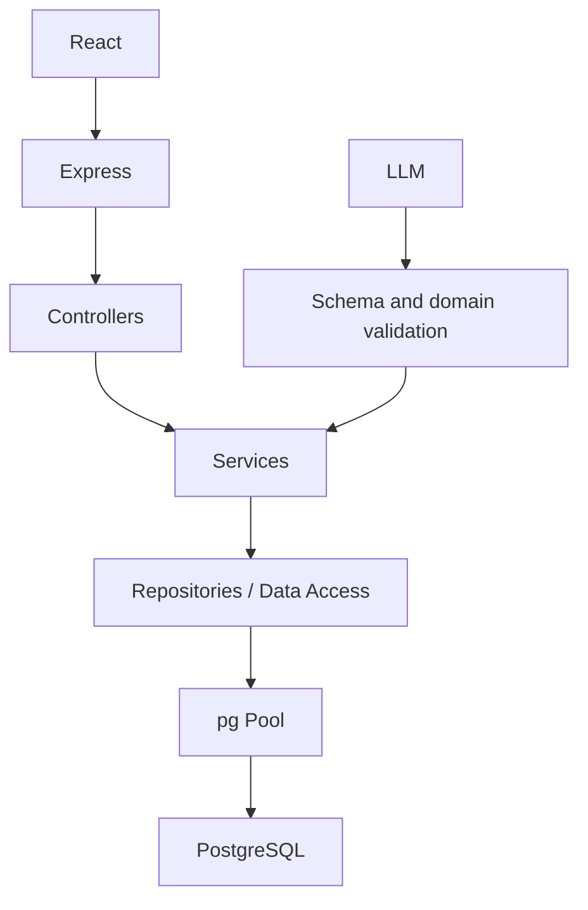
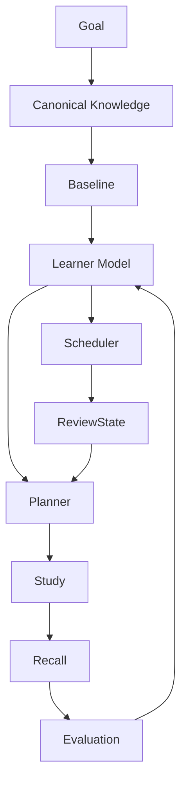

# RecallLoop Architecture

## Runtime



The application uses one PostgreSQL pool. Controllers remain thin, services own domain decisions, repositories own SQL, and PostgreSQL owns durable state. There is no MongoDB runtime, Redis, queue, microservice, or second database.

## Domain flow



Canonical knowledge answers what a role may require. Personal concepts, recall history, confidence, mistakes, mastery, and review state answer what a learner has demonstrated. Canonical skills and learner skills are separate tables; canonical concepts and personal concepts are separate tables.

## Persistence boundary

- `authService -> userRepository -> app_users`
- `goalService -> goalRepository / learnerSkillRepository / planRepository / planTaskRepository -> goals / learner_skills / plans / plan_tasks`
- `studySessionService -> study/concept repositories -> study_sessions / personal_concepts`
- `recallService -> recall repositories -> recall_attempts / recall_evaluations / recall_knowledge_point_results / review_states`
- `learnerModelService -> SQL read queries -> personal concepts, evaluations, reviews, learner skills`
- `dashboardService -> SQL joins and aggregates -> user-scoped dashboard data`
- `learningEventService -> event repository -> learning_events`
- `knowledgeService -> PostgreSQL queries -> canonical knowledge and provenance tables`
- `baselineService -> PostgreSQL queries -> baseline assessments, questions, and learner states`
- `resourceRecommendationService -> PostgreSQL queries -> resources and resource coverage`

Ownership is derived from `req.user.id`. Clients never provide an authoritative `user_id`.

## Evaluation and transactions

The LLM is used only for concept extraction and rubric evaluation. Structured output is schema validated, then domain services persist it. LLM numeric `overallCoverage` is ignored; coverage is derived from knowledge-point statuses: correct = 1, partial = 0.5, missing = 0.

Recall submission loads and validates the attempt, performs evaluation outside the database transaction, then must atomically persist the attempt answer, normalized evaluation rows, concept mastery, review state, and learning events. Study completion must atomically update the session, create immediate recalls/reviews, and append its event. Plan replacement and baseline submission have the same focused transaction requirement.

## Scheduling and planning

`ReviewState` is the authority for recall timing. The deterministic interval scheduler computes the next review from coverage and prior state. The planner consumes due reviews, weakness signals, canonical goal requirements, baseline starting point, and time budget to create `PlanTask` rows. It does not create a second recall scheduler and does not call the LLM.

## Startup and shutdown

1. Load `DATABASE_URL` and application configuration.
2. Verify PostgreSQL connectivity through the single pool.
3. Start Express.
4. On SIGINT/SIGTERM, stop the HTTP server and close the pool.

Run migrations and curated seed before startup:

```bash
npm run db:migrate -w server
npm run db:seed -w server
npm run dev
```

## Verification boundary

Unit tests run without a database. PostgreSQL integration tests run with `npm run test:integration -w server` and require a running PostgreSQL instance. The current environment has no Docker executable and no PostgreSQL listener, so those tests are reported as blocked rather than replaced with an in-memory fake.
