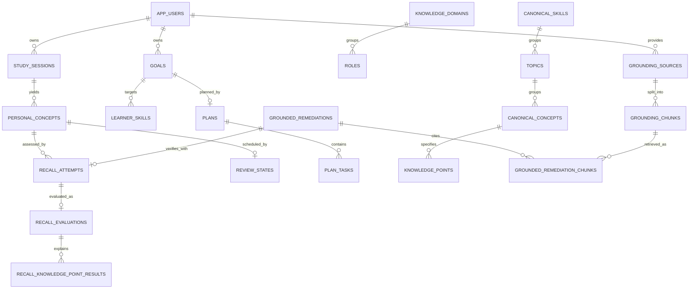

# PostgreSQL data model

This reference follows `server/migrations/*.sql` in the migration order implemented in `server/src/db/postgres.ts::runPostgresMigration`. PostgreSQL is the runtime source of truth. IDs are UUIDs; timestamps use PostgreSQL timestamp types. Read the migration SQL for exact columns and indexes.

## Ownership and main relationships

Authenticated data is scoped by `app_users.id`; user-owned tables carry `user_id` directly or through an owned parent, and services check ownership before access. `knowledge_*` canonical catalog rows are shared reference data. Canonical concepts/skills are distinct from `personal_concepts`/`learner_skills`; the latter are learner progress and goal-specific records.

## Tables by domain

| Domain | Tables | Role / notable constraints |
|---|---|---|
| Identity | `app_users` | Unique email; stores password hash and review preference. |
| Goals/planning | `goals`, `learner_skills`, `plans`, `plan_tasks` | User-owned goals; plan unique per user/goal; task references goal, skill, concept, attempt; checks constrain task types/status/requiredness/minutes. |
| Study/recall | `study_sessions`, `personal_concepts`, `recall_attempts`, `recall_evaluations`, `recall_knowledge_point_results`, `review_states`, `learning_events` | Session-derived personal concepts; attempt/evaluation relationship; point-level evidence; one review row per user/concept; event history. |
| Assessment | `questions`, `recall_dimension_results`, `assessment_sessions`, `assessment_recommendations` | Questions belong to personal concepts; attempts optionally link to question/session; dimension evidence and session ordering are persisted. |
| Canonical knowledge | `knowledge_domains`, `roles`, `canonical_skills`, `topics`, `canonical_concepts`, `knowledge_points`, `concept_prerequisites`, `knowledge_sources`, `concept_sources`, `role_skills` | Shared role/skill/topic/concept graph, prerequisites and provenance; cascading deletes within catalog relationships. |
| Baseline | `baseline_assessments`, `baseline_questions`, `learner_knowledge_states` | User/goal-scoped assessment, question responses, and observed/self-declared state keyed to canonical concepts. |
| Resource catalog | `resources`, `resource_coverage` | Shared resource metadata and concept coverage, unique resource URL. |
| Grounded remediation | `grounding_sources`, `grounding_chunks`, `grounded_remediations`, `grounded_remediation_chunks` | User-owned source text/chunks, processing state and embeddings, retrieval provenance, remediation and verification linkage. |
| Import compatibility | `legacy_id_map` | Maps legacy IDs to PostgreSQL records during migration/import. |

Schema is additive across migrations `001`–`010`; `003_core_domain.sql` creates core user-owned tables and is deliberately applied first by the custom ordering, followed by canonical schema/seed and feature migrations. Later migrations add assessment, planning, resource-link and grounding columns/tables. Do not assume alphabetical order equals application order.

Grounding vectors are stored as PostgreSQL `real[]` in migration `010`, with model name and dimension alongside each vector. Retrieval currently ranks a bounded set of a user's chunks in application code; this schema does not use pgvector or a vector index. Chunk rows cascade with their source, while cited chunks cannot be deleted while a remediation references them (`ON DELETE RESTRICT`).

## Important integrity rules

- Numeric mastery, coverage, confidence, difficulty, priority, and hint-count fields have explicit `CHECK` bounds in migrations.
- `recall_evaluations.recall_attempt_id` is unique, so one attempt has at most one normalized evaluation.
- `review_states` is unique by `(user_id, concept_id)`; `plans` by `(user_id, goal_id)`.
- Plan and assessment status/type fields are constrained; assessment-mode constraints are extended by migration `008_application_practice.sql`.
- Foreign-key deletion behavior is intentional: most user-owned children cascade with the owner/parent; optional task references and attempt links may use `SET NULL` to preserve task/assessment history.
- Retrieval and learner summaries are user-scoped in service queries. The schema alone is not a substitute for authorization checks.

## Transactions and lifecycle

`server/src/db/postgres.ts::withTransaction` acquires a pool client, runs `BEGIN`, commits only on success, rolls back on an exception, and releases the client. The principal grouped writes are plan-task replacement, study completion, baseline result application, recall submission, assessment setup, grounding chunk persistence/retrieval links, and selected remediation state changes. Some operations intentionally call external/model providers before entering the transaction; provider failure therefore produces no partially committed learner evidence.

For exact columns and indexes, consult [`server/migrations`](../server/migrations/). Migration application does not occur automatically at API startup; run `npm run db:migrate -w server` against the configured database.
