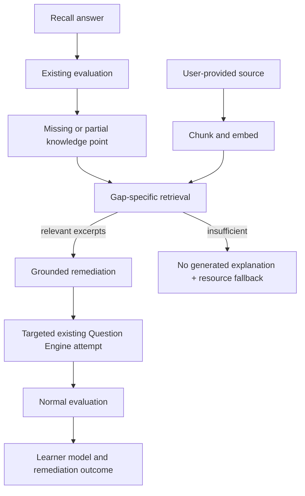

# Grounded remediation (Phase 6A)

Grounded remediation is a narrow, evidence-led loop built on RecallLoop's existing concepts, evaluations, assessment questions, learner model, and resource catalog. It does not create another learner-state model or a general chat/tutor feature.

## Data flow

1. A learner pastes plain text or Markdown they are allowed to use into Focused Resources and records the source title and original URL/path. RecallLoop does not fetch that URL.
2. Ingestion normalizes line endings, computes a SHA-256 content version, chunks deterministically, embeds the chunks, and persists the source and chunk metadata.
3. A submitted recall with a missing or partial knowledge point can trigger focused remediation. The service reads the attempt, rubric results, mistakes, confidence, and recent results for that same point.
4. It queries only the learner's processed sources, ranks chunks against concept + exact knowledge point + any recorded misconception, and rejects results below the relevance threshold.
5. A grounded generator produces a validated structure. Local development uses a deterministic extractive generator; the optional LLM generator receives only the evidence and retrieved excerpts and is instructed to report unsupported details.
6. The learner sees the reason, explanation, excerpt, title, and source reference, then can start a single targeted verification question using the existing Question Engine.
7. Verification is a normal RecallAttempt. The existing evaluator, dimension evidence, scheduler, and learner-model updates run as usual. In the same persistence transaction, the remediation records the targeted point's evidence before and after; `improved` is true only if the weighted evaluated point score increased.

## Entities and ownership

- `grounding_sources` stores a user-owned document version, original reference, provenance JSON, source type, content hash, and processing state. Identical content from the same user reuses the same row; changed content creates a new version. A source may optionally point at an existing `resources` row.
- `grounding_chunks` stores stable content-derived IDs, order, character offsets, chunk text, embedding model/dimension, and embedding values.
- `grounded_remediations` stores the triggering attempt, exact weak point, evidence-backed reason, lifecycle, generated structure/error, verification attempt, before/after point evidence, and the comparison result.
- `grounded_remediation_chunks` records the exact retrieved chunk IDs and rank/relevance used for a remediation.
- The verification remains in `questions`, `assessment_sessions`, `recall_attempts`, `recall_evaluations`, `recall_knowledge_point_results`, and `recall_dimension_results`. The attempt's optional `remediation_id` links it back to the lifecycle record.

All reads and writes are scoped to the authenticated user. Source references are attribution metadata, not a license to fetch or reproduce remote content.

## Chunking, embeddings, and retrieval

Chunking defaults to 1,200 characters with 160 characters of overlap. Boundaries prefer whitespace; IDs are SHA-256-derived from source version, order, and chunk text. Source ingestion is capped at 250,000 characters per document.

`EmbeddingProvider` separates embedding from retrieval. The default `hash-token-v1` provider is deterministic and has no credential requirement. It is suitable for local use and tests, not a production semantic model. `OpenAiCompatibleEmbeddingProvider` is available only when `EMBEDDING_PROVIDER=openai-compatible` and `EMBEDDING_API_KEY` are explicitly set; it also uses `EMBEDDING_BASE_URL` and `EMBEDDING_MODEL`. Provider/model identity and dimension must match at retrieval time.

The current PostgreSQL instance does not offer the `vector` extension (`pg_available_extensions` contains no `vector`). To keep migrations runnable here, embeddings are stored in PostgreSQL `real[]`; the service uses cosine similarity plus deterministic significant-token overlap and a fixed relevance threshold. Retrieval is bounded to the most recent 5,000 matching chunks per learner. If pgvector is installed in a later deployment, the repository can move the same provider output to a vector column and database index.

## Grounding and fallback rules

- No relevant chunk means no explanation is generated. The learner sees that material was not found and gets up to three existing resource recommendations when any match.
- A source that fails processing is kept with `processing_status=failed` and a bounded error. Posting the same text again retries it idempotently.
- Embedding provider errors persist a failed lifecycle/source state and do not mutate learner evidence.
- Generator failure retains retrieved chunk links and source attribution. Retrying the remediation request reuses the existing remediation row rather than duplicating it.
- The deterministic local generator extracts relevant source sentences. It may report that no specific misconception was recorded rather than invent one.
- The optional LLM generator uses the existing `LlmProvider`, validates a Zod-checked JSON structure, receives no authority to update learner state, and has no numeric mastery field. Set `REMEDIATION_PROVIDER=llm` explicitly along with a configured non-mock `LLM_PROVIDER` and `LLM_API_KEY` to enable it. Otherwise the deterministic generator remains active.

## API and UI

- `POST /api/grounding/sources` ingests `{ title, text, sourceType, reference?, provenance? }`.
- `GET /api/grounding/sources` lists the current user's source metadata.
- `POST /api/remediations/from-attempt/:attemptId` creates or returns the remediation for a submitted attempt.
- `GET /api/remediations/:id` reads the lifecycle and cited excerpts.
- `POST /api/remediations/:id/verify` creates or returns the targeted existing recall attempt.
- Verification answers use the existing `POST /api/recalls/:id/submit` endpoint.

Focused Resources includes a small source-text form. Recall Result offers the remediation action when its persisted recommendation is remediation. The remediation view shows the weak point, evidence reason, generated content, source excerpts/attribution, and targeted verification. After submission, the recall result links to the stored comparison.

## Tests and limits

Unit tests cover stable chunking, deterministic embeddings, ranking/irrelevant rejection, structured validation, extractive grounding, fallback, and targeted question variants. PostgreSQL integration tests use the real configured DB and cover source idempotency/provenance, ownership, retrieval, remediation persistence, verification/evaluation/model update, no relevant source, invalid embeddings, and generation retry.

Known limitations: only pasted text/Markdown is ingested; PDF parsing and URL fetching are intentionally absent. The deterministic mock embedder is not a substitute for production semantic embeddings. The current PostgreSQL deployment lacks pgvector, so ranking currently happens in application code over bounded per-user chunk rows. LLM output is constrained and validated but still requires human review for product quality. Evidence scores and the improved flag are transparent product heuristics, not a validated learning-science measure.

## Manual learner scenarios

With the API running against a migrated PostgreSQL database, create a learner account and add a small source through Focused Resources (for example, notes that explicitly explain the TCP congestion window and receiver window). Then try:

1. **Strong recall:** answer the relevant knowledge point correctly. Remediation should not be recommended for that point.
2. **Weak recall:** omit a central distinction. The result should offer a focused remediation with an evidence-based reason and an attributed excerpt.
3. **Repeated misconception:** submit another weak answer that repeats the same misconception. The reason should reflect the persisted history, and the verification should use new wording for the same point.
4. **No relevant material:** ingest an unrelated source and request remediation for a gap. The UI should explain that useful material was not found and show existing resource recommendations when available.
5. **Improved verification:** answer the targeted question more completely. The normal evaluation should update learner evidence, and the remediation record should show the before/after outcome.

These are product checks, not proof of learning-science validity. Automated PostgreSQL coverage and manual browser exercise status are tracked separately in [Project Status](PROJECT_STATUS.md).
