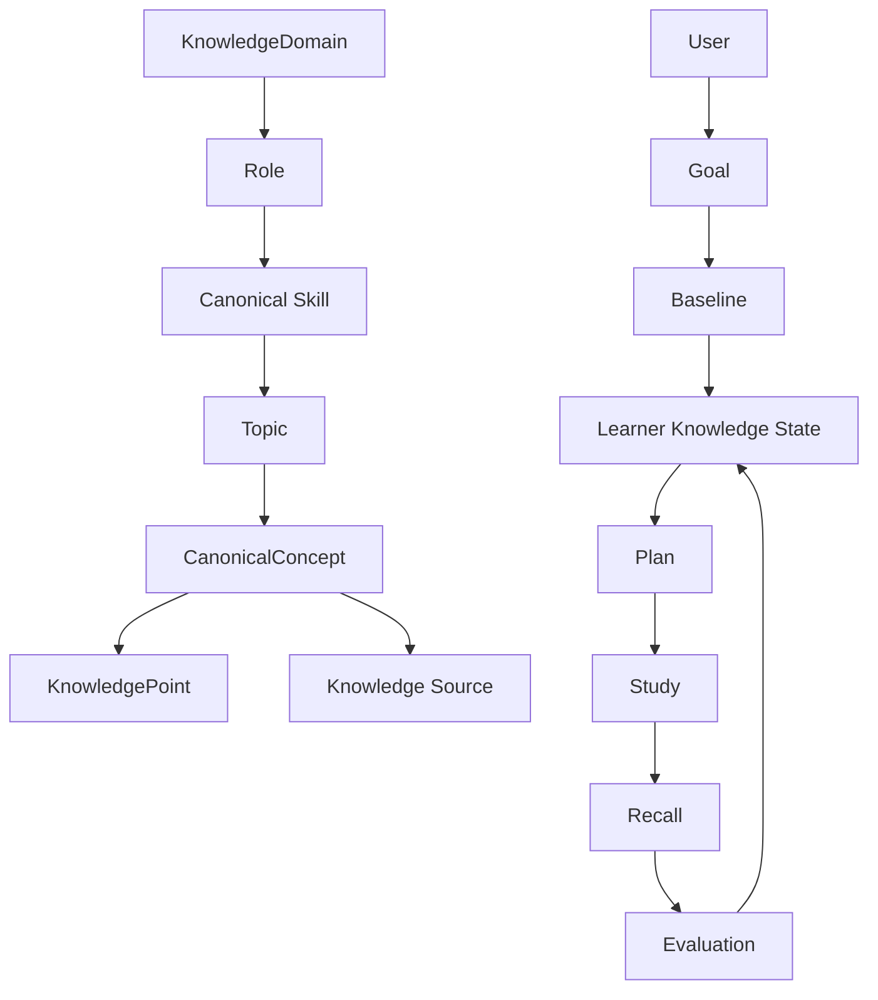

# Phase 3 Knowledge Model

## Canonical knowledge versus personal learner state

Canonical knowledge answers **what a role may require**. It is curated, versioned, and supported by source references. Personal learner state answers **what this learner has demonstrated or declared**. It is user-scoped and can change after baseline answers and normal recall.

## Canonical entities

- `KnowledgeDomain` groups reusable reference knowledge.
- `Role` maps a learner-facing role to required canonical skills.
- `canonical_skills` define stable capabilities and target mastery.
- `Topic` groups concepts under a canonical skill.
- `CanonicalConcept` is a versioned concept with difficulty and lifecycle status.
- `KnowledgePoint` is an assessable statement attached to a concept.
- `ConceptPrerequisite` is a normal relational edge, not a graph database.
- `KnowledgeSource` records provenance, trust tier, and version/date.
- `Resource` stores metadata and links only; content is not copied into the database.
- `ResourceCoverage` maps resources to concepts with coverage strength.

The first curated seed includes Backend Engineer and System Design roles, backend fundamentals such as HTTP, SQL, caching, rate limiting, messaging, concurrency, operations, and system-design concepts.

## Baseline assessment

A learner selects a canonical skill and one of `new`, `familiar`, or `advanced`.

- `new`: no assessment; starts from fundamentals.
- `familiar`: deterministic 3-5 question blueprint.
- `advanced`: deterministic 5-8 question blueprint.
- `Trust me`: skips questions but stores `baselineSource=self_declared` and a bounded confidence; it never sets mastery to 1.0.

Questions cover L1 recognition, L2 recall, L3 application, L4 depth, and L5 transfer. The existing evaluator is reused. Its validated knowledge-point coverage is stored on `baseline_questions`; there is no second evaluation engine.

Observed mastery is the mean of submitted rubric coverage. Baseline confidence is the mean answer confidence normalized to 0-1 for assessed paths. Self-declared mastery is a heuristic prior (`new=0.10`, `familiar=0.45`, `advanced=0.65`) and remains separate from observed mastery. These are transparent heuristics, not scientifically precise estimates.

## Starting point and resources

`StartingPointService` selects the lowest observed canonical state for review, skips concepts at or above 0.8 mastery, and asks `ResourceRecommendationService` for at most four links. Recommendations rank lower trust tier first, prefer difficulty near the learner's bounded level, prefer stronger concept coverage, and never exceed the available minutes after the first selected resource.

Every recommendation returns estimated minutes, concepts covered, and a deterministic reason containing mastery, gap, time, and trust information.

## Planning boundary

The planner consumes canonical requirements, baseline state, weak concepts, due recall state, starting-point information, and the goal budget. It creates work but does not invent curriculum with an LLM. `ReviewState` remains authoritative for recall timing; baseline is initial evidence and normal recall remains the path for future learner updates.
