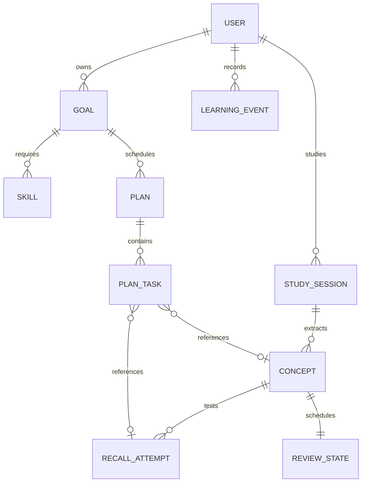

# RecallLoop Learning Model

## Purpose

This phase establishes a small, deterministic domain model for goal-aware learning. MongoDB remains the only database. The LLM extracts concepts and evaluates answers, but it does not own identity, authorization, scheduling, learner state, or plan persistence.

## Domain terms

1. **Goal**: the learner's desired outcome, such as becoming a backend engineer.
2. **Skill**: a capability required by a goal, such as Redis or SQL joins. Skills are manually created in this phase.
3. **Topic**: the learner-facing subject represented by a study session or skill. It is not a separate persistence model yet.
4. **Concept**: a teachable unit extracted from study material.
5. **Knowledge Point**: a required fact or behavior attached to a concept and used by the rubric evaluator.
6. **Study Session**: a learner-owned capture of material studied for a topic.
7. **Recall Attempt**: a learner-owned retrieval question and answer attempt.
8. **Evaluation**: the validated rubric result embedded in a recall attempt. Coverage is derived from knowledge-point statuses.
9. **Review State**: the authoritative timing and interval state produced by the scheduler for a concept.
10. **Learner Model**: a deterministic view assembled from concept mastery, recall history, confidence, mistakes, and review state.
11. **Plan**: a learner-owned time window for work toward a goal.
12. **Plan Task**: a bounded unit of learn, recall, practice, assessment, or remediation work inside a plan.

## Authority and flow

The product loop is:

`Goal -> Plan -> Study -> Recall -> Evaluation -> Learner Model -> Scheduler -> Plan`

The planner consumes `ReviewState` for due timing and `LearnerModelService` for weakness signals. It creates `PlanTask` records but never creates a second recall schedule. A recall task references the existing concept and pending recall attempt when available.

## Observed, derived, and heuristic values

- **Observed**: answer text, confidence, evaluation statuses, mistakes, timestamps, scheduler outcome, and stored mastery.
- **Derived**: recall success rate, mistake count, due count, average mastery, weak concepts, and weak skills.
- **Heuristic**: concept status thresholds and the blend used to update `Concept.mastery`. These are intentionally transparent approximations, not scientific mastery claims.

## Why the boundaries matter

Structured multi-part questions preserve evidence for each required point label in `learner_knowledge_point_states`. A correct part updates only its own state; missing or partial evidence for another part remains visible independently. Aggregate attempt coverage and concept mastery remain separate projections for existing scheduling and summaries.

- The planner and recall engine are separate because planning decides what work to expose while recall owns question attempts and answers.
- The scheduler and planner are separate because the scheduler decides when a concept is due while the planner decides how today's bounded work is composed.
- The LLM is not authoritative because probabilistic output must be validated before persistence and cannot decide access, timing, or critical transitions.
- `ReviewState` is authoritative for recall timing. `PlanTask` mirrors due work for a learner-facing plan and must not become an independent scheduler.
- `LearningEvent` is append-only history for auditability and future analytics; it is not used as a second source of truth for scheduling.

## Missed-task policy

When today is opened, planned tasks scheduled before today are marked `missed`. Due recall work remains highest priority. Lower-priority learning and practice tasks are admitted only while the daily budget allows, so missed tasks are not all piled onto the next day. Full optimization and rescheduling are intentionally deferred.
