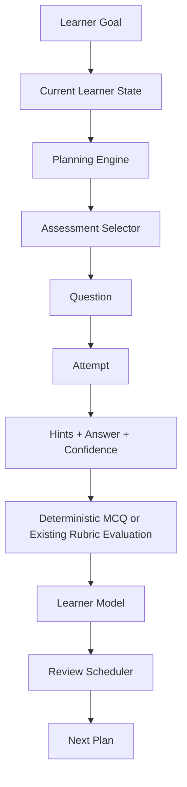
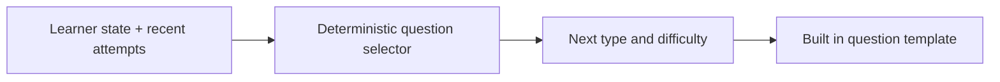

# RecallLoop Question Engine

The question engine extends the existing recall attempt and rubric evaluation flow. A normalized `questions` row describes each prompt; `recall_attempts` stores the learner's response and process signals. PostgreSQL migration `004_question_engine.sql` adds the question relation, optional MCQ metadata, hint counters/timestamps, confidence/time fields, dimension scores, and plan task ordering/category. Existing attempts remain valid with a null `question_id`.

## Question model and types

Question types are `mcq`, `rapid_recall`, `short_explanation`, `descriptive`, `comparison`, `scenario`, `application`, and `transfer`. Legacy `explain`, `compare`, and `coding` values remain supported for old attempts. The six assessment dimensions are recognition, recall, explanation, application, depth, and transfer. The frontend presents titles such as Quick Check, Rapid Fire, Explain, Apply, Deep Recall, and Transfer Challenge.

Questions currently use deterministic built in templates based on a user's personal concept and required knowledge points. MCQ options, the answer key, explanation, and related points live on the question row. MCQs are graded by `evaluateMcq` against the stored option identifier. Free form responses continue through the existing evaluator; evaluation does not schedule reviews or select plan tasks.

Some `short_explanation` questions with multiple distinct required points are represented as structured parts. Each part has an ID, label, prompt, point association, and rubric. The client renders one field per part; the existing recall endpoint accepts the part ID with its answer. Each nonempty part is evaluated in isolation by the existing provider abstraction. Omitted/blank parts are recorded as `missing` without a model call. Other question types and single-point explanatory questions retain their single-answer shape.

## Hints and evidence

Each eligible built in question stores three hints. The API reveals one at a time and atomically increments the attempt's `hints_used`, `max_hint_level`, and timestamps. Question responses contain only already revealed hints, never the unrevealed hint text. A small transparent heuristic weights learner evidence at 1.0, 0.85, 0.70, or 0.55 for zero through three hints. The evaluator's raw coverage remains unchanged for result display; the weighted value updates concept mastery and review scheduling. These values are product heuristics, not scientifically validated estimates.

## Selection and learner model

`selectAssessment` uses current concept mastery, recent coverage, repeated failures/successes, recent question types, and available minutes. New or weak concepts start with recognition/recall; stronger evidence advances toward application, depth, and transfer. Recent type history avoids immediate repetition where possible. This is deterministic and does not ask an LLM to choose questions.

Per-attempt dimension evidence is stored in `recall_dimension_results`. Concept state returns average scores for the six dimensions that have evidence; unsupported dimensions remain absent/null rather than being fabricated. Confidence, time taken, hints used, and actual evaluation coverage remain attached to each attempt for later calibration analysis.

For structured parts, `recall_knowledge_point_results` stores the part ID alongside each point result. `learner_knowledge_point_states` updates each `(user, personal concept, point label)` independently inside the recall transaction. Existing aggregate coverage and concept mastery remain for reports and scheduling, but do not overwrite one point's state with another's. Current personal point labels do not have canonical UUID relationships in the schema.

## Rapid Fire, Deep Recall, and Mastery Check

Assessment sessions are persisted in `assessment_sessions`; their question attempts remain ordinary `recall_attempts` so the existing evaluator, review scheduler, and learner model continue to own those responsibilities. Rapid Fire creates five short questions and automatically advances after each submitted answer. Deep Recall creates one descriptive prompt. Mastery Check creates a balanced six-question blueprint with one item per assessment dimension and reports dimension scores plus the weakest sampled area when all questions are submitted. Incomplete sessions remain in progress and have no final result.

## Planner and `Why this?`

Today's plan sorts due recall first, then goal learning, application practice, and critical remediation. Due recall and very weak concept remediation are marked MUST DO; learning and practice are RECOMMENDED. Practice tasks can start a Rapid Fire session. Task reasons are stored in the plan task record and shown in the reusable `WhyThis` component. The generator accepts an available-minute budget, orders tasks coherently, avoids duplicate recall attempts, and skips work that would exceed the budget. Available, planned, and remaining minutes are returned to the client.

## API and migrations

- `POST /api/assessments` with `{ conceptId, mode }` starts a Rapid Fire, Deep Recall, or Mastery Check session.
- `GET /api/assessments/:id` returns progress and completed dimension results.
- `POST /api/recalls/:id/hints` reveals only the next persisted hint.
- Existing `POST /api/recalls/:id/submit` accepts free-form `answer` or deterministic `selectedOptionId`, plus confidence.
- For structured questions, the same endpoint accepts `answers: [{ partId, answer }]` plus confidence; IDs must belong to that question. Legacy questions continue to accept `answer`.
- Goal plan generation accepts `availableMinutes` (0–240); the stored plan retains its budget for subsequent Today views.

Migrations `004_question_engine.sql`, `005_assessment_sessions.sql`, `006_plan_time_budget.sql`, and `011_structured_question_parts.sql` are additive and preserve existing attempts and plans.

## Wiring

The evaluator only scores the answer. Attempt persistence updates concept evidence, and the existing scheduler computes the next review date. The planner organizes learning work using actual due dates, mastery, and goal skill data.
